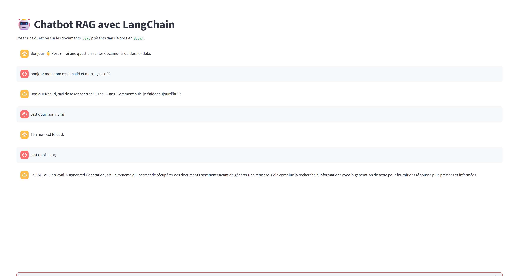

# 🤖 Chatbot RAG avec LangChain & Streamlit

## 📌 Description

Ce projet consiste en la création d’un **chatbot intelligent basé sur la technique RAG (Retrieval-Augmented Generation)** permettant de répondre à des questions à partir de documents locaux.

Le système combine :

* 🔍 Recherche d’information (FAISS)
* 🧠 Modèle de langage (OpenAI)
* 🖥️ Interface interactive (Streamlit)

---

## 📸 Aperçu de l'application

<p align="center">
  
</p>
---

## 🎯 Objectifs

* Charger et indexer des documents locaux
* Transformer les documents en embeddings
* Effectuer une recherche sémantique
* Générer des réponses pertinentes avec un LLM
* Offrir une interface utilisateur simple

---

## 🧱 Architecture du projet

```bash
langchain_tp/
│
├── data/                  
│   └── cours_ia.txt
│
├── src/
│   ├── config.py         
│   ├── rag.py            
│   ├── tools.py          
│   ├── middleware.py     
│   └── simple_agent.py   
│
├── streamlit_app.py      
├── requirements.txt      
├── README.md             
└── images/
    └── demo.png
```

---

## ⚙️ Installation

### 1️⃣ Cloner le projet

```bash
git clone <repo_url>
cd langchain_tp
```

### 2️⃣ Créer un environnement virtuel

```bash
python -m venv .venv
```

### 3️⃣ Activer l’environnement

➡️ Windows:

```bash
.venv\Scripts\activate
```

➡️ Mac/Linux:

```bash
source .venv/bin/activate
```

### 4️⃣ Installer les dépendances

```bash
pip install -r requirements.txt
```

---

## 🔑 Configuration

Créer un fichier `.env` à la racine du projet :

```env
OPENAI_API_KEY=your_api_key_here
OPENAI_MODEL_SIMPLE=gpt-4o-mini
OPENAI_MODEL_ADVANCED=gpt-4o-mini
EMBEDDING_MODEL=text-embedding-3-small
```

---

## 📂 Ajouter les documents

Place tes fichiers `.txt` dans le dossier :

```bash
data/
```

Exemple :

```bash
data/cours_ia.txt
```

---

## ▶️ Lancer l’application

```bash
streamlit run streamlit_app.py
```

Puis ouvrir :

```
http://localhost:8501
```

---

## 🧠 Fonctionnement

1. Chargement des documents
2. Découpage en chunks
3. Transformation en embeddings
4. Stockage dans FAISS
5. Recherche des passages pertinents
6. Génération de réponse avec LLM

---

## 🔍 Technologies utilisées

* Python 🐍
* Streamlit 🖥️
* LangChain 🔗
* FAISS 🔍
* OpenAI API 🤖

---

## 📊 Exemple d’utilisation

💬 Question :

```
Qu’est-ce que le RAG ?
```

🤖 Réponse :

```
Le RAG est une méthode qui combine recherche d’information et génération de texte...
```

---

## ⚠️ Problèmes fréquents & solutions

### ❌ ModuleNotFoundError

```bash
pip install -r requirements.txt
```

---

### ❌ API Key invalide

* Vérifier `.env`
* Vérifier la clé OpenAI

---

### ❌ Erreur Streamlit session_state

👉 Ne pas utiliser `st.session_state` dans les fichiers backend directement

---

## 🚀 Améliorations possibles

* Support PDF
* Mémoire conversationnelle
* UI améliorée
* Ajout d’un agent intelligent
* Multi-documents

---

## 👨‍💻 Auteur

Projet réalisé dans le cadre d’un TP LangChain
🎓 Génie Informatique – Intelligence Artificielle

---

## 📄 Licence

Usage pédagogique uniquement.

---


